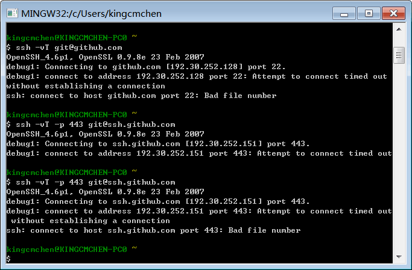

[category]: git
[keywords]: git,github,ssh
[source]: https://help.github.com/articles/generating-ssh-keys/
[date]: 2014-10-22

SSH keys 是一种用于验证受信息电脑的方式, 可以避免输入密码. 下列步骤演示如何生成 SSH key 并将 public key 添加到 GitHub 账号中.

> 建议: 定期检查自己的 SSH keys list 并取消近期不使用的 key.

# 第1步: 检查 SSH keys
首先, 检查电脑上已存在的 SSH keys. 打开 Git Bash 并输入:

	$ ls -al ~/.ssh
	# Lists the files in your .ssh directory, if they exist

检查该目录看看是否有已存在的 public SSH key。 缺省的 public key 的文件名如下:
+ id_dsa.pub
+ id_ecdsa.pub
+ id_ed25519.pub
+ id_rsa.pub

截图显示我的电脑上并不存在 public SSH key.

# 第2步: 生成新的 SSH key
拷贝粘贴以下代码到 Git Bash 中, 用于生成新的 SSH key. 当然, 要确认使用你自己的邮箱地址. 建议使用缺省配置, 也就是说, 提示符后显示 "Enter a file in which save the key" 时, 直接按回车就行了.

	$ ssh-keygen -t rsa -C "your_email@example.com"
	# Creates a new ssh key, using the provided email as a label
	# Generating public/private rsa key pair.
	# Enter file in which to save the key (/c/Users/you/.ssh/id_rsa): [Press enter]

接下来, 会提示你输入密码.

> 建议: 强烈建议设置安全的密码.

	Enter passphrase (empty for no passphrase): [Type a passphrase]
	# Enter same passphrase again: [Type passphrase again]

然后会得到类似提示:

	Your identification has been saved in /c/Users/you/.ssh/id_rsa.
	# Your 	public key has been saved in /c/Users/you/.ssh/id_rsa.pub.
	# The key fingerprint is:
	# 01:0f:f4:3b:ca:85:d6:17:a1:7d:f0:68:9d:f0:a2:db your_email@example.com

将新的 key 添加到 ssh-agent:

	# start the ssh-agent in the background
	ssh-agent -s
	# Agent pid 59566
	ssh-add ~/.ssh/id_rsa

我的操作截图如下:

但很不幸, `ssh-add` 这一步出错了:

错误原因及解决办法[这里][Could not open a connection to your authentication agent]

# 第3步, 将 SSH key 添加到 GitHub
运行以下命令将 key 拷贝到 clipborad. 记住, 你的 key 也可能叫 id_dsa.pub, id_ecdsa.pub 或 id_ed25519.pub.

	$ clip < ~/.ssh/id_rsa.pub
	# Copies the contents of the id_rsa.pub file to your clipboard

也可以选择你喜欢的文本编辑器打开 public key 文件并手动拷贝其内容.

拷贝了 public key 之后就可将它添加到 GitHub 了:

1. 在任何页面中右上角的 user bar 中点击 Settings 图标
2. 点击左侧的 SSH Keys
3. 点击 Add SSH key
4. 在 Title 字段添加新 key 的描述. 比如你使用个人 Mac, 可以将其命名为 "Personal MacBook Air"
5. 粘贴 key 到 Key 字段
6. 点击 Add key
7. 输入 GitHub 密码并确认

# 第4步, 测试是否正常
现在需要 SSHing 到 GitHub 来检查是否配置正确. 执行　SSHing 时会被要求输入密码验证该操作, 即创建 SSH Key 时使用的密码.

打开 Git Bash 并输入:

	$ ssh -T git@github.com
	# Attempts to ssh to github

你可能看到以下警告:

	The authenticity of host 'github.com (207.97.227.239)' can't be established.
	# RSA key fingerprint is 16:27:ac:a5:76:28:2d:36:63:1b:56:4d:eb:df:a6:48.
	# Are you sure you want to continue connecting (yes/no)?

不用担心! 这是正常的. 确认你终端上显示的指纹跟前面提供的一致, 然后输入 "yes".

	Hi username! You've successfully authenticated, but GitHub does not
	# provide shell access.

如果这里显示的 username 正是你的名字, 那说明你已经成功建立了 SSH key! 不用担心 "shell access" 之类的问题, ... (原文: Don't worry about the "shell access" thing, you don't want that anyway.)

如果显示 "access denied" 信息, 请阅读[这里](https://help.github.com/articles/error-permission-denied-publickey)进行诊断.

如果你从 HTTPS 切换到 SSH, 还需要更新远程仓库的 URL 了. 更多信息见[这里](https://help.github.com/articles/changing-a-remote-s-url).

运气不行, 到这一步我电脑上又出错了. 

这个错误比较麻烦了, 它跟网络环境有关, 比如公司内网防火墙之类的. GitHub 官方有关于[这个错误的说明][Bad file number]及[相应的解决办法][Using SSH over the HTTPS port].

有人提到这点

> 通过ssh协议连接git仓库肯定要走代理了，因为内网绝对必然封了22端口

还好从公司内部KM平台上找到了相应的解决方案, 步骤如下:

运行 Git Bash, 输入

	vim ~/.ssh/config

输入以下内容配置内网代理

	HOST github.com *.github.com
	  ProxyCommand corkscrew web-proxy.oa.com 8080 %h %p

注意这里用到了一个名为 corkscrew 的代理工具

[Using SSH over the HTTPS port]: https://help.github.com/articles/using-ssh-over-the-https-port/
[Bad file number]: https://help.github.com/articles/error-bad-file-number/
[Could not open a connection to your authentication agent]: http://stackoverflow.com/questions/17846529/could-not-open-a-connection-to-your-authentication-agent
[fix error 2]: http://km.oa.com/group/15681/articles/show/81034?kmref=search
[fix error 3]: http://km.oa.com/articles/show/104599?kmref=search
