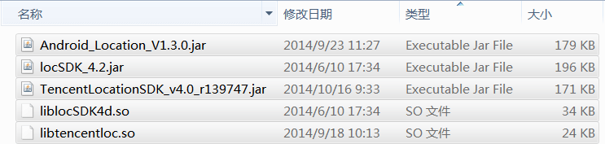

[category]: work
[keywords]: sdk
[source]: 

TencentLocationSDK.jar 包大小为 171KB，目前仍然为最小。但考虑到 libtencentloc.so 大小为 24KB，实际上已经比高德的定位SDK要大一些了。

TencentLocationSDK 包大小主要由以下几个部分构成：
1. jar = 网络包(80KB) + 定位功能(70KB) + Geofence功能(20KB)
2. so, native 代码

可优化的点：
1. 使用旧的网络包(仅20KB) 左右
2. 将 Geofence功能 分拆，打包成 core.jar + geofence.jar
3. 精简 log, log 中包含大量字符串
4. 优化代码及proguard配置(可能没有明显效果)

---
# 1. 线上最新版本

+ jar
170 KB = 哈雷(80KB, 未混淆) + 围栏(20KB) + 定位(70KB)

+ so
24 KB

## 下一版本可能导致继续增大的部分
1. 5号接口 (json结构跟之前的差异太大)
2. 方向传感器

# 2. 现有策略
进行一些减少包大小的尝试，使用以下策略后可减小约 30 KB

1. 减少不必要的类层次结构, 减少包大小约 400 B

2. 一个类实现多个接口，去掉过多的嵌套类， 减少包大小约 2108 B

3. 增加 proguard-sdk-nolog.prop 配置，去掉全部log，减少包大小约 3463 B

4. 对 halley sdk 进行混淆，并去年全部log，减少包大小约 17765 B

		192,170 - 174,405 = 17765
5. repackageclasses 使用更简短的名字, 减少包大小约 2705 B

		174,405 - 171,700 = 2705

6. 编写脚本去掉 LogUtil 调用，减少包大小约 4092 B

		171,700 - 167,608 = 4092

## 其他策略
1. 线上版本去掉 key 兼容方案 
2. 线上版本 so 打到 jar 包 (由于so被压缩， 可减少 10KB 左右)

# 3. 功能分离

分为 三个 jar， 客户端按需使用

+ 定位-core.jar (必须, 不带网络功能)
+ 围栏.jar (可选)
+ 哈雷.jar (可选，提供网络功能.)

客户端一般都有自己的 Http 实现，可自行实现 TencentHttpClient接口，替换掉哈雷SDK，可以极大地减少包大小。 

这种方式给客户端带来一定的复杂性，网络问题引起的定位失败排查更麻烦。