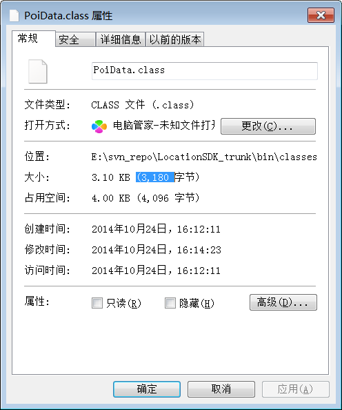

[category]: java
[keywords]: class
[source]: 
[date]: 2014-10-24

# 内联方法
## 影响
减少类的方法对生成的class文件大小有什么影响呢？分析时不考虑以因素，即全部使用缺省值。

1. javac编译参数
2. proguard优化

以这段代码为例进行分析(注意，这里不是完整的代码)。在 PoiData 的构造方法中直接调用了 PoiData 的一个私有方法 update。其实我们完全可以直接将 update 方法内联到构造方法。内联前后生成的class大小会有什么样的变化？

	public class PoiData implements TencentPoi {
		...	
		public PoiData(JSONObject poiJson) throws JSONException {
			update(poiJson);
		}

		private void update(JSONObject poiJson) throws JSONException {
			try {
				name = poiJson.getString("name");
				addr = poiJson.getString("addr");
				catalog = poiJson.getString("catalog");
				dist = poiJson.optDouble("dist");
				uid = poiJson.getString("uid");
				latitude = poiJson.optDouble("latitude");
				longitude = poiJson.optDouble("longitude");

				_addr_5_support(poiJson);
			} catch (JSONException e) {
				LogUtil.e("TencentJson", "json error", e);
				throw e;
			}
		}
		...
	}

以下是内联前后class大小变化对比

从内联前的3,275 字节减少到内联后的3,180 字节，减少了大约100字节，减小的字节数的还是相当可观的。

## 原因分析

